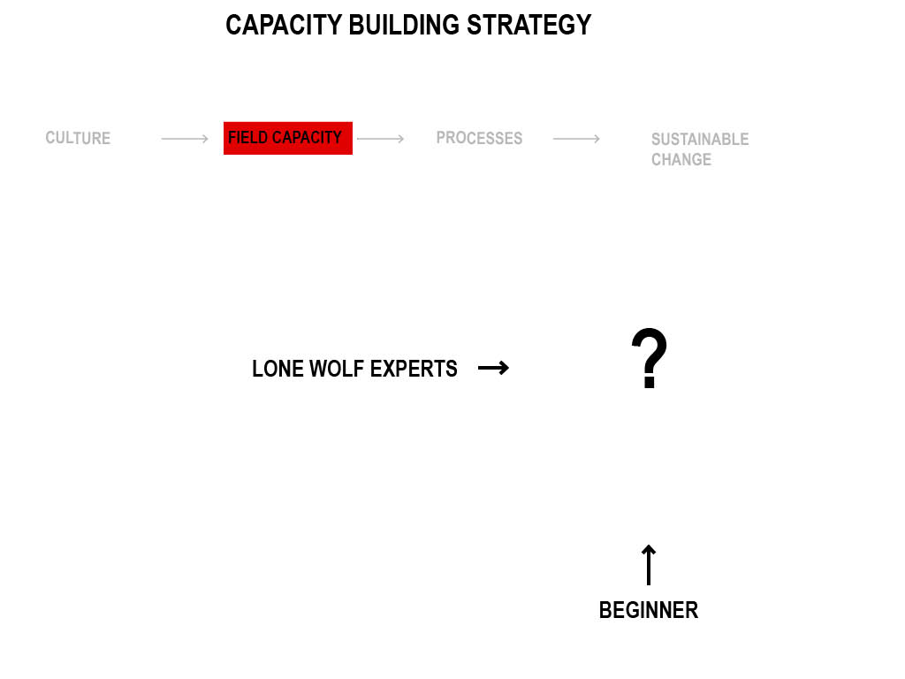
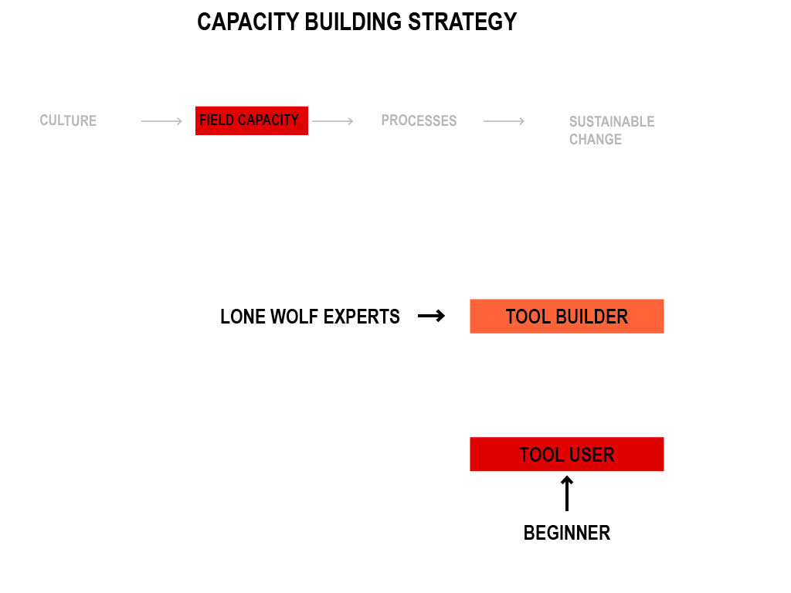
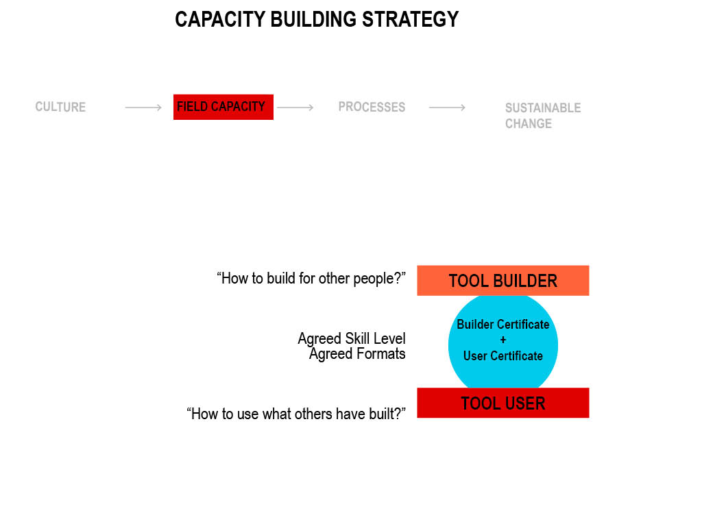
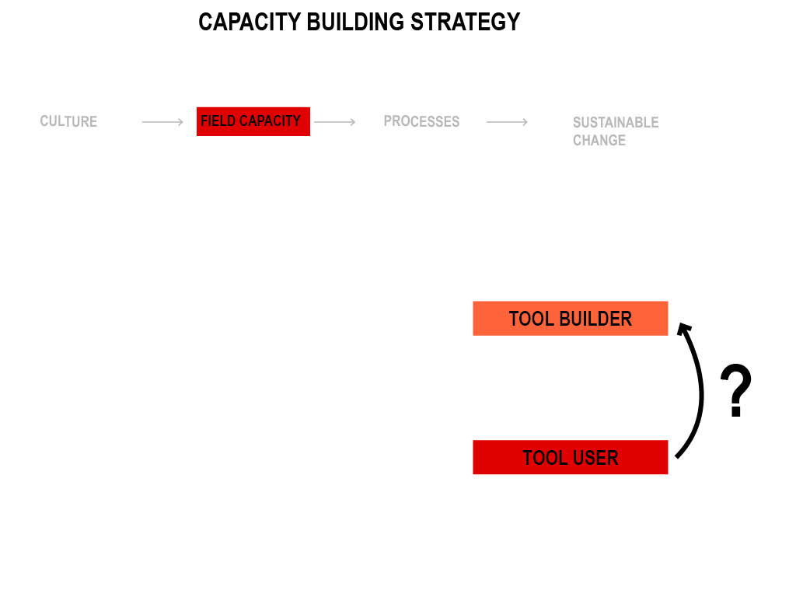
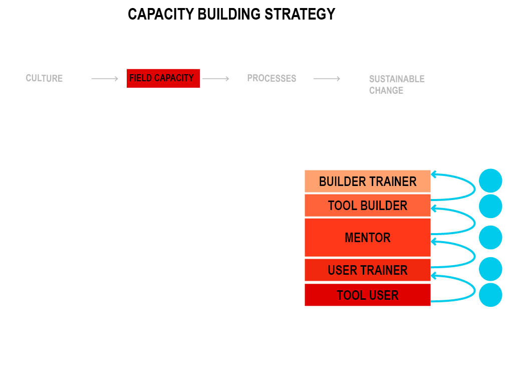

```{r setup, include=FALSE}
# ioslides_presentation slidy_presentation
knitr::opts_chunk$set(echo = FALSE)
```

# Not a smooth ride

## Questions!

- questions are everything!
- Might feel hard because there are so MANY easy things at once
- You are here because you are really talented

## This is a Pilot

- Stuff will go wrong
- I need your feedback
- No one in the humanitarian system has (successfully) done this before

# General Strategy {data-background="background.svg"}

## IMPACT strategy:

- More Work 

## Data Unit Strategy: {data-background="background.svg"}

- More work => Deeper Analysis
- More work => Fewer Errors
- More work => Less Work


## Components {data-background="background.svg"}

- Culture
- **Capacity**
- Processes
- Sustainable Change

# Data Unit capacity building framework {data-background="background.svg"}

##   {data-background="background.svg"}
##  {data-background="background.svg"}
##  {data-background="background.svg"}
##  {data-background="background.svg"}
##  {data-background="background.svg"}

# Learning Goals {data-background="background.svg"}

## NOT the learning Goals {data-background="background.svg"}

- *Not* a training on specific tools
- *Not* a data science degree in 2 days
    - (not statistics)
    - (not generic R)
    - (not quantitative research methods)


## NOT NOT the learning Goals {data-background="background.svg"}

_"Not a training on specific tools"_

- *Instead*: how to access and use all current and future (R) tools developed in IMPACT
- (..with specific tools as concrete examples)

## Examples {data-background="background.svg"}

- simple data cleaning checks
- Basic analysis of random samples (in line with Guidelines)

# Agenda {data-background="background.svg"}

## day 1 {data-background="background.svg"}

- 09:00 - 10:30 Prerequisite test / Introduction / Overview
- 11:00 - 13:00 Sharing Tools in R / at Impact
- 14:00 - 16:00 Practical Session 1A
- 16:30 - 18:00 Practical Session 1B

## day 2 {data-background="background.svg"}

- 09:00 - 10:30 Analysis Guidelines: With great power great responsibility
- 11:00 - 13:00 The "hypegrammaR" package: R implementation of the guidelines
- 14:00 - 14:30 **R Environments and structuring self contained projects**
- 14:30 - 16:00 Practical Session 2
- 16:30 - 18:00 **Brainstorm**

## day 3 {data-background="background.svg"}

- 09:00 - 10:30 **Certification Test: Work on solutions**
- 11:00 - 13:00 Bonus session: Going beyond

## Feedback / Questions? {data-background="background.svg"}


# 1.1.3 why R is Powerful

## *a primitive function*: R commands
```{r,echo=T}
sum(1,1)
```

```{r,echo=T}
sum
```

## *a function*: A few lines of code turned into a new command

```{r,include=F}
some_data<-data.frame(some_variable=rnorm(100),another_variable=rnorm(100)+1.5)
```

```{r,echo=TRUE}
colSums(some_data)
```

The code behind:
```{r,echo=T}
colSums
```

**THIS CHANGES EVERYTHING!!! WHY?**

## a "complicated" function

```{r, echo=T}
library(keras)
application_resnet50
```


## A package


a collection of functions that solve a specific problem

- Standardised
- Reliable
- Documented
- locked & hidden details
- "Stackable": can be used in other functions/packages
- Shared through a standardised channel

## the Result

[source](https://www.r-bloggers.com/on-the-growth-of-cran-packages/)


## Questions/Feedback?

# Accessing R Packages

```{r,include=FALSE}
library("UpSetR")
movies <- read.csv( system.file("extdata", "movies.csv", package = "UpSetR"), header=T, sep=";" )
mutations <- read.csv( system.file("extdata", "mutations.csv", package = "UpSetR"), header=T, sep = ",")
```

## Finding Packages

- google _"how to .... in R"_
- tutorials
- https://rseek.org/
- https://awesome-r.com/
- https://support.rstudio.com/hc/en-us/articles/201057987-Quick-list-of-useful-R-packages
- the classics: tidyverse, sf, lubridate, survey, magrittr, rmarkdown 

- RStudio conference (youtube)
- Twitter


## Install
```{R,echo=T,eval=F}
install.packages("UpSetR")
```

## Load
```{r,echo=T,eval=F}
library("UpSetR")
```

## Learn
```{r,echo=T,eval=F}
?UpSetR
?upset
```

## Use
```{R,echo=T}
upset(movies, nsets = 6)
```

## Behind the curtains
```{r,echo=T}
upset
```

full source code: google _"PACKAGENAME site:www.github.com"_

# R Packages on Github

## Gitwhat?

## *git*

### a system to manage code projects

- track and save changes (rewind!)
- manage parallel versions
- merge versions
- collaborate


## *Github*

### an online platform for git

- collaborate online
- share code
- interact with users/developers
      - bug reports
      - feature requests
      - _not_: asking for help (stackoverflow!)


example 1: [This Presentation](https://github.com/mabafaba/impact_R_user_training/)

example 2: [the 2019 MSNA tool](https://github.com/mabafaba/msna18/network)

example 3: [issues (ggplot2)](https://github.com/tidyverse/ggplot2/issues)


## Installing R packages from Github

```{r, eval=F}
install.packages("remotes")
```

```{r, eval=F,echo=T}
remotes::install_github("ellieallien/cleaninginspectoR",
                        build_opts = c()
                        )
```

- "USERNAME/REPOSITORYNAME"
- `build_opts=c()`: makes sure to also download the manual (see `?remotes::install_github`)

## Load 
```{r, eval=T,echo=T,warning=FALSE,message=FALSE}
library("cleaninginspectoR")
```

### Learn

Overview:
```{r,eval=F,echo=T}
?cleaninginspectoR
```
Manuals / Help Documents
```{r,eval=F,echo=T}
browseVignettes("cleaninginspectoR")
```
List all functions
```{r,echo=T,eval=F}
ls("package:cleaninginspectoR")
```
Type `Packagename::` and hit `tab` to see available functions

```{r,echo=F}
knitr::kable(data.frame("contents"=ls("package:cleaninginspectoR")),format="html")
```
Use!
```{r, echo=T}
find_outliers(some_data)
```


## Getting Started with IMPACT R tools

1. Go to https://rpubs.com/impact_dataunit/impactpackages
2. Follow instructions

## Questions?

... and feedback?

# ~ COFFEE / TEE / NAPS ~

# SESSION 1.2. HANDS ON!

## Panic!

- Trial and Error is the name of the game
- errors are a conversation!
- if you see an error..
    - check your spelling
    - _read_ the message! Any useful tips?
    - google
    - ask for help

## Steps:

- _The Data Cleaning Checks Tool_
  	- find the package on the repository list: https://rpubs.com/impact_dataunit/impactpackages
  	- install the package
  	- browse the vignettes; Read the "quickstart" vignette
  	- load your data
  	- read the vignette of the function(s) you are going to use
  	- run the data cleaning checks on your data
  	- save the results to a csv file.

solution: `read.csv("mydata.csv") %>% data_cleaning_checks %>% write.csv`

### Bonus

- file a feature request on the github issues page 


# Day 1 feedback summary

## Strategy

Tools need to..

- be documented extensively
- be generalisable
- have mentorship (ideas?)
- be self-contained
- be clear on requirements for inputs (added for today)
- well written code
- accessible for debugging

## Packages

- include example input in the package (added for today)
- easier installation for people with fresh R

## Field led

Field teams to lead on

- what tools should be built
- what the interface should be like
- (etc!) <- ?

**best way?**

## Training

- Real life examples is good
- More informal exchange
- How to structure an analysis project? (added for today)
- Hackathon / Brainstorming session (added for today)
- build something together (tiny version added for tomorrow)

**adding: brainstorming session!**

    - outcomes: list of problems + solution proposals/ideas + priorities
    - no big time comittments, but clear plan forward

**adding: session on structuring self-contained projects**


# The Quantitative Data Analysis Guidelines

## what they are NOT: How to perform an analysis

## what they ARE (hopefully):

- Approaching data analysis to get meaningful results in context of the research questions/design
- _Which_ statistical procedures you need (.. but not how to perform them) 
- How to interpret the results
- Implications for reporting

## Distinguishing exploratory vs. validatory analysis

- *Exploratory*: Generating hypothesis
- *Validatory*: Refuting hypothesis


## "Torture your data and it will confess to anything"

Mitigation strategies 1/2:

- (predefined hypothesis)
- Transparency
- Generate, then **try to refute** with different data (confirmation bias!)
- _Think hard about what you are going to look at_

## "Torture your data and it will confess to anything"

Mitigation strategies 2/2: Adjusting the critical P-Value
- Bonferroni correction (p_critical_eff = p_critical * num_tests)
- False Discovery Rate
- **problem with this???*
      

## Stats 101

- [There is only one test](http://allendowney.blogspot.com/2011/05/there-is-only-one-test.html)
    - *compute a test statistic* -> effect size
    - *Identify Null hypothesis*: The observed effect size is due to chance
    - *Do a million times*: "Fake" samples from a distribution that matches the null hypothesis
    - *What percentage of those shows an effect size equal or stronger to what we observed?* -> that's a p-value 
    - *Finally: don't do that, use an analytical approximation instead*

## Guidlines: Analysis Cases

    
## Guidlines Structure: What do you want to know?
- Population of interest
- Sampling strategy
- Hypothesis
- Dependent and independent variables
- Data Types
- Hypothesis type
    
=> "Analysis Case" => Appropriate statistics, visualisations, hypothesis tests


## 


## Interpretation

  - Coherent results: low confidence
  - Coherent results: high confidence
  - Conflicting results: low confidence
  - Conflicting results: high confidence

.. Good data = more accurate results but more importantly
.. Good data = results you *TRUST*


# The hypegrammaR Package

## Goal

_Enable people to think more about why they do the analysis and what exactly they want to find out and report on, instead of having to know about or work on how to choose and apply the appropriate summary statistics, hypothesis tests and visualisations._


## How?

_If each combination of data types, hypothesis types and sampling strategy can be associated uniquely with an appropriate summary statistic, hypothesis test and visualisation we can..._

## 

## 


# Structuring a project

## Environments & Namespaces

## RMarkdown

# Let's go


# LUNCH


# 


# DAY 3
## SESSION 3.1.1: grand finale
- chamapgne

## SESSION 3.2.2: BONUS SESSION
- tidyverse?
- rmarkdown: the gold standard of reproducible data science
- custom functions / building tools for yourself